# The Napari Assistant

The Napari Assistant is a plugin for napari that allows you setting up an image processing workflow.

This tutorial is also available as video [napari-assistant.mp4](images/napari-assistant.mp4).

Start napari from the command line like this:

```bash
conda activate my_first_env

napari
```

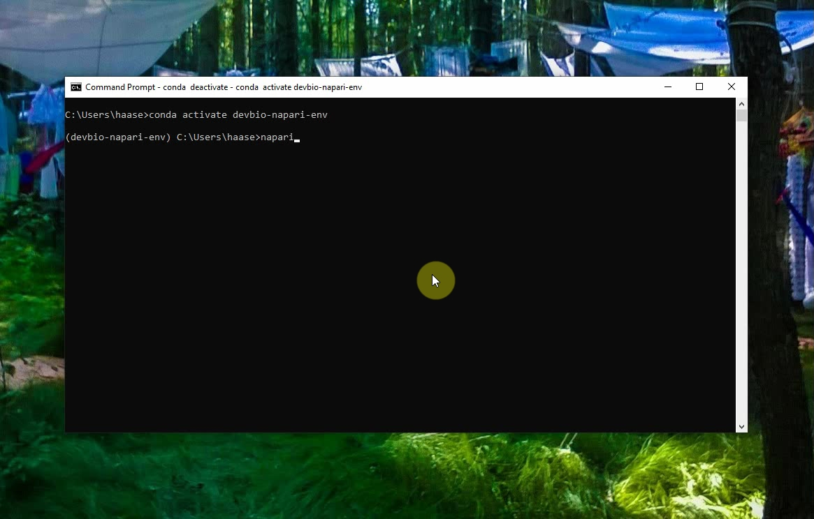

The napari window will open. Click on the menu `File > Open Samples Cells(3D+2Ch)` to open an example image.

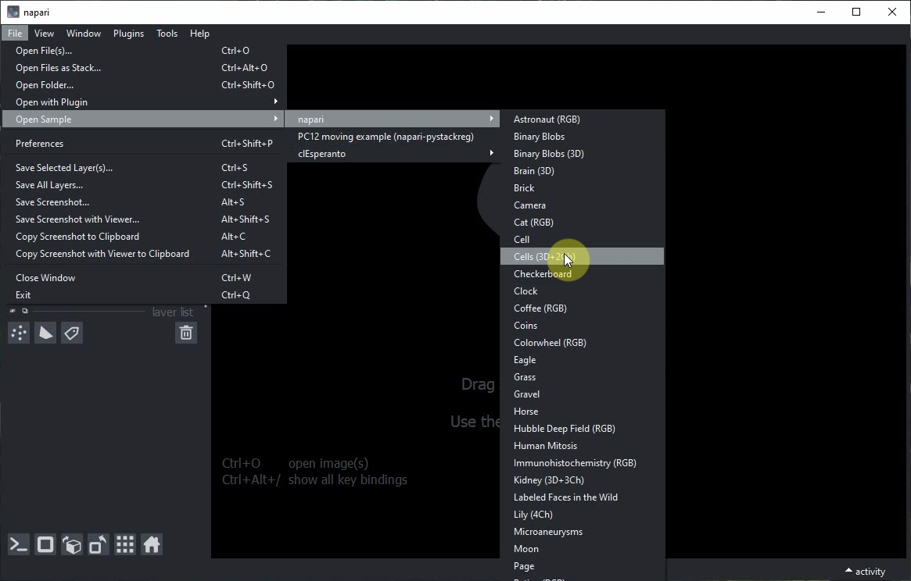


You can explore this dataset by clicking on the `2D/3D` view button.

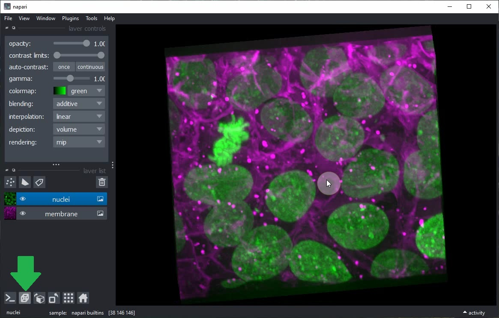

Start the Napari Assistant from the `Tools > Utilities > Assistant (na)` menu.

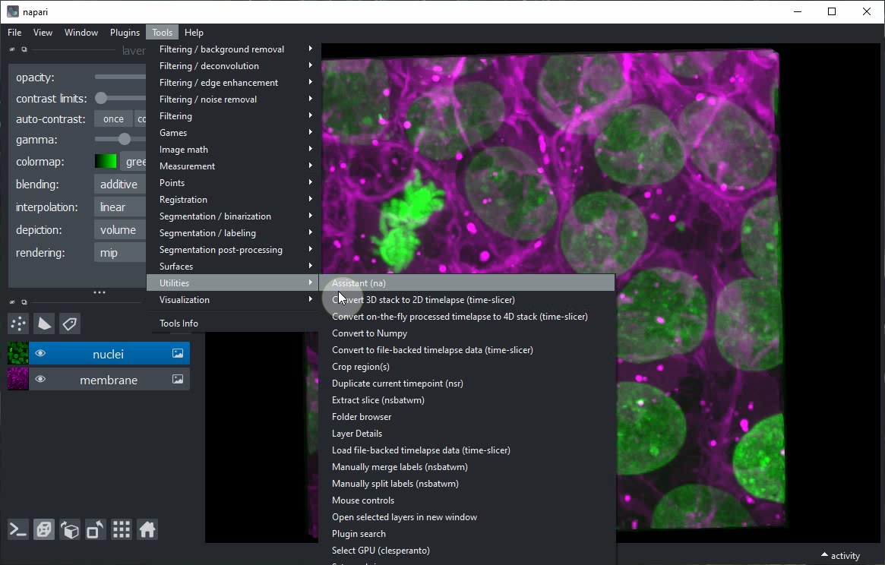

Within the `Assistant` panel, click on the `Remove noise` button.

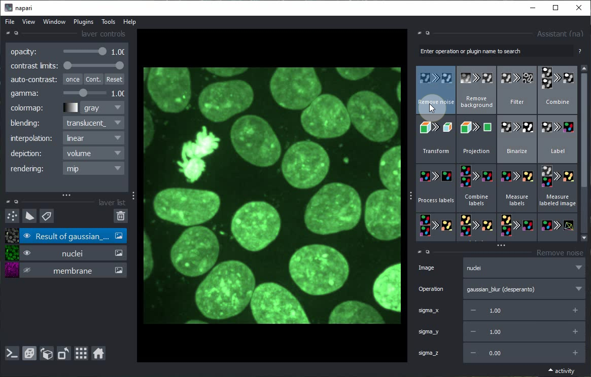

Click on the `Eye` buttons in the layer list to hide the original image and show the result of the `Remove noise` step only.

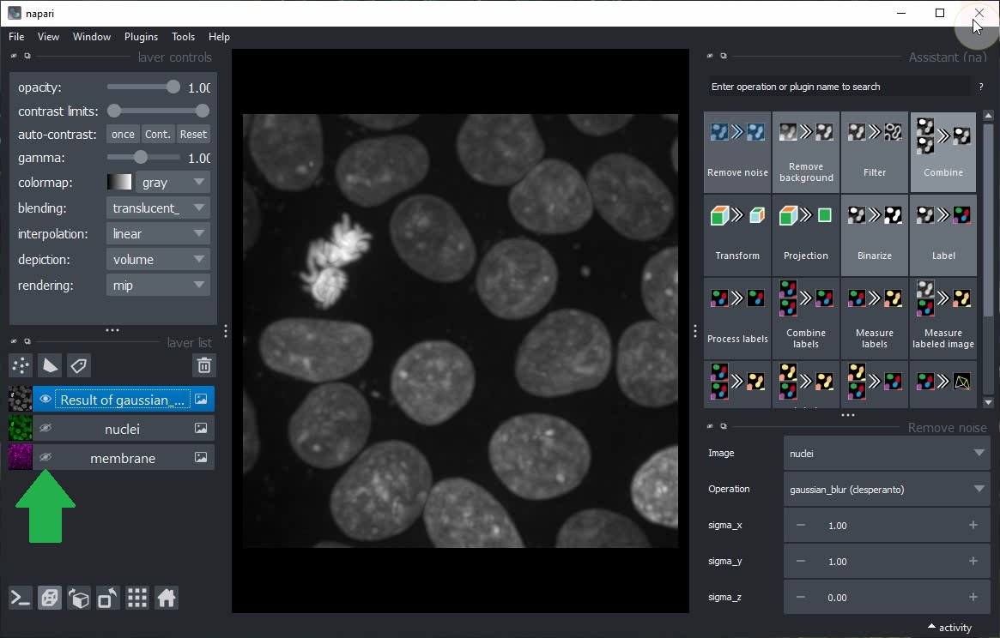

Click on the `Binarize` button in the Assistant panel to add a new step to the workflow that generates a binary image from the current layer.

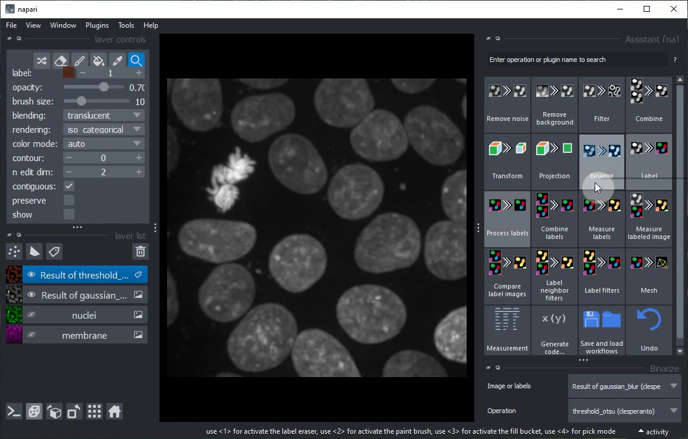

Toggle 2D/3D view and layer visibility to explore the result of the `Binarize` step.

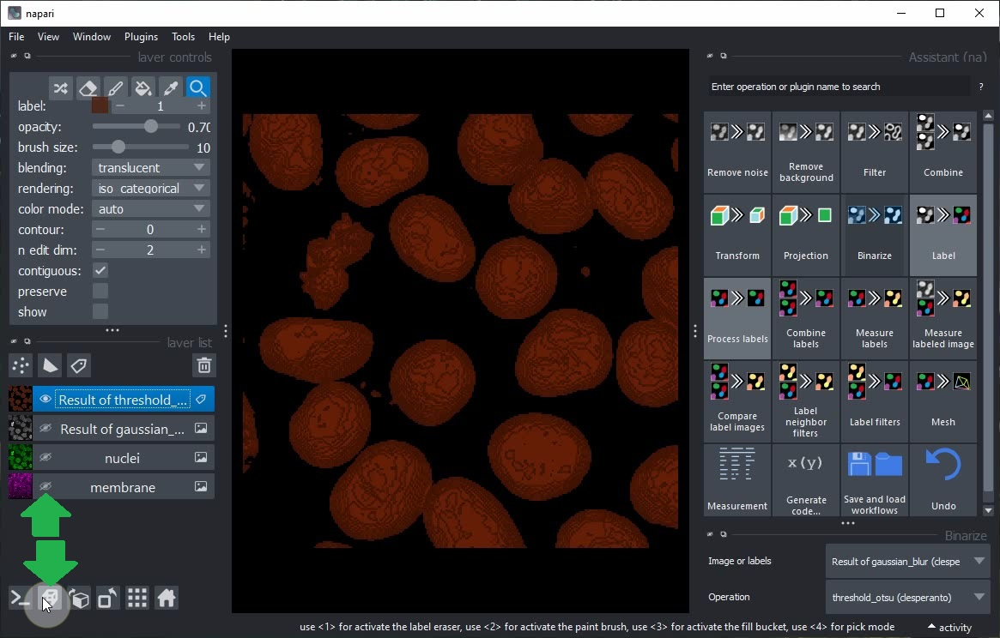

After switching back to 2D view, click the `Label` button in the Assistant and choose the operation `Connected component labeling (clEsperanto)`.

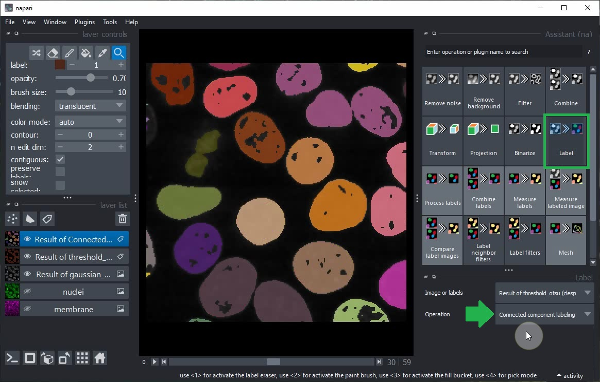

Select the `Result of gaussian_blur` layer in the layer list and modify its `sigma` parameters. You will note that the subsequent steps (Threshold Otsu and Connected Component Labeling) are also updated.

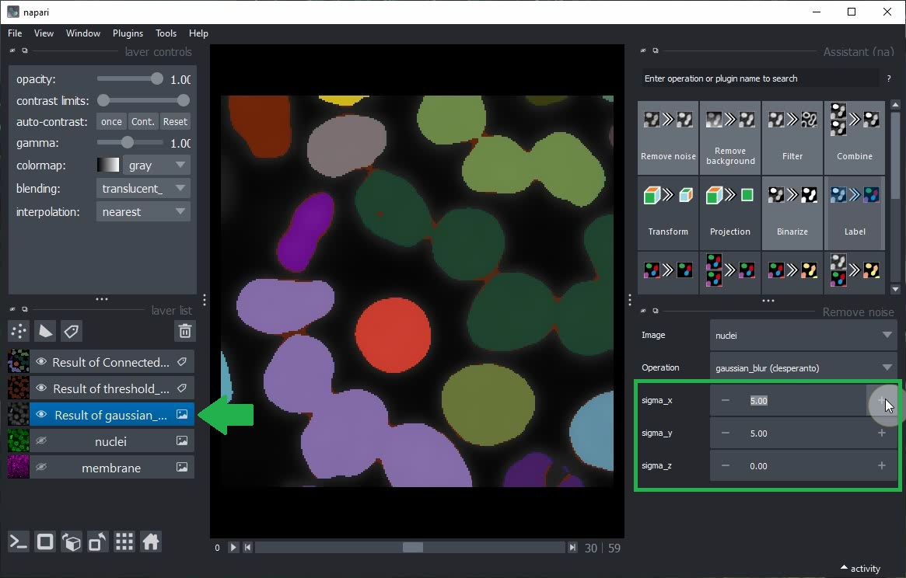

Switch to grid view, show all layers using their `Eye` buttons and continue modifying the parameters.

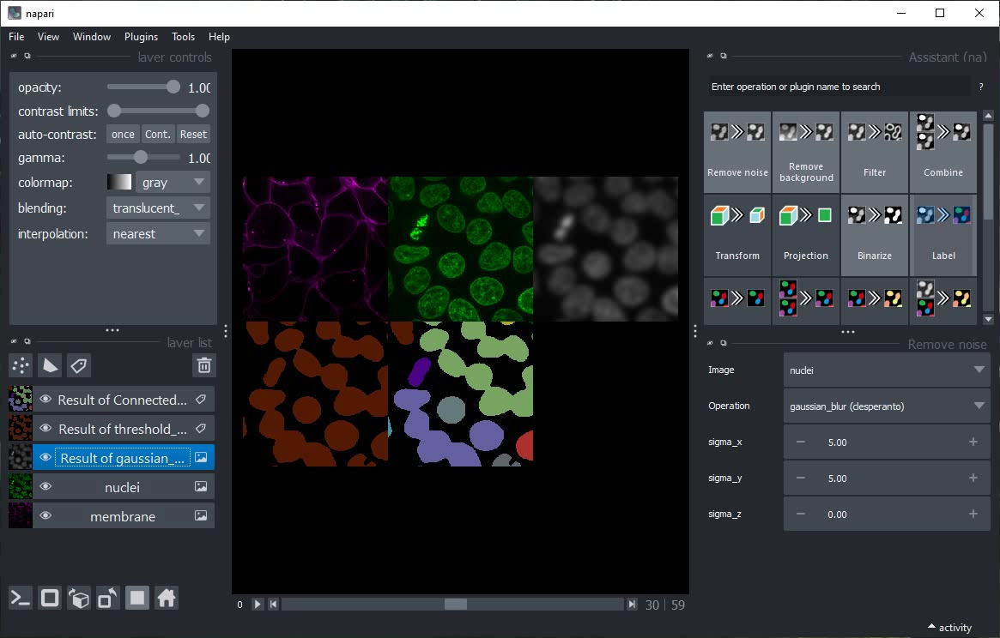

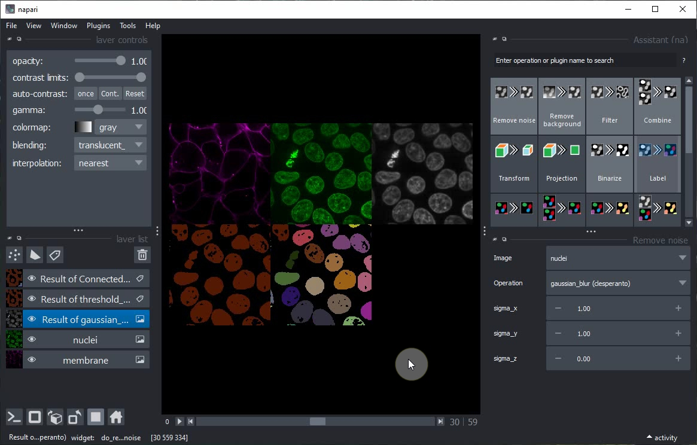

Close all layers except `nuclei` and `membrane`.

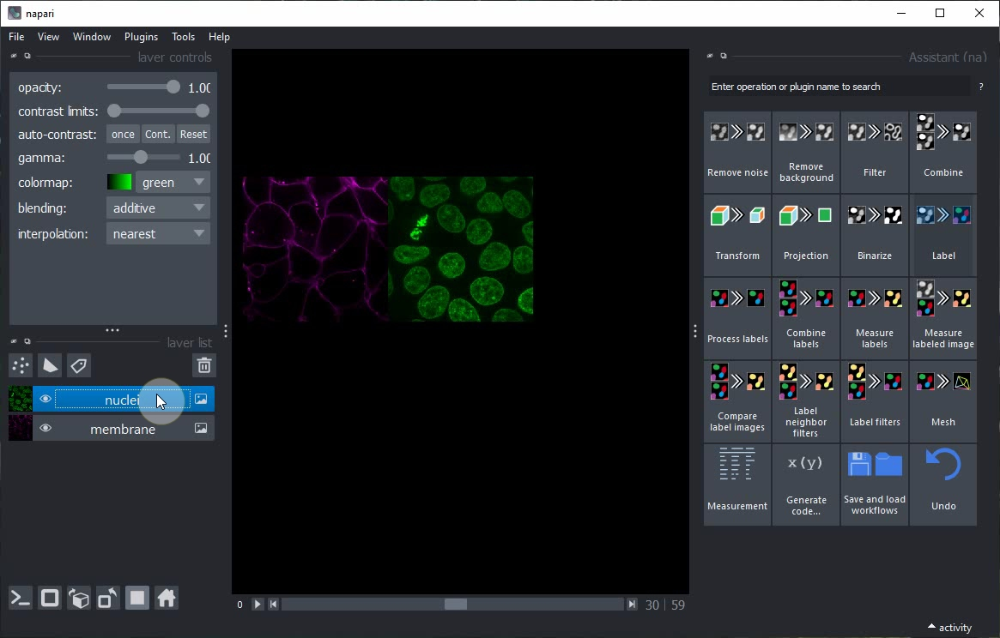

Turn of Gridview and click again on the `Label` button in the Assistant.

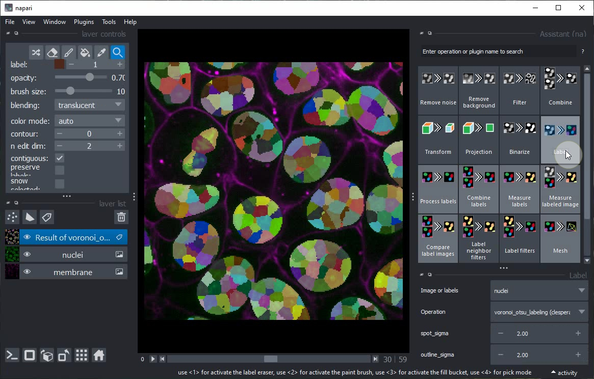

This time, do not change the operation but the `spot_sigma` parameter instead.

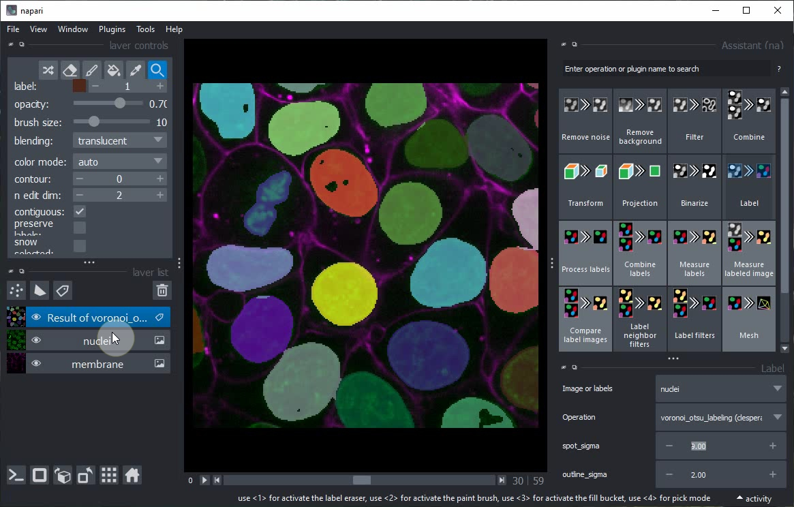

Toggle again to 3D view and inspect the result of this single step.

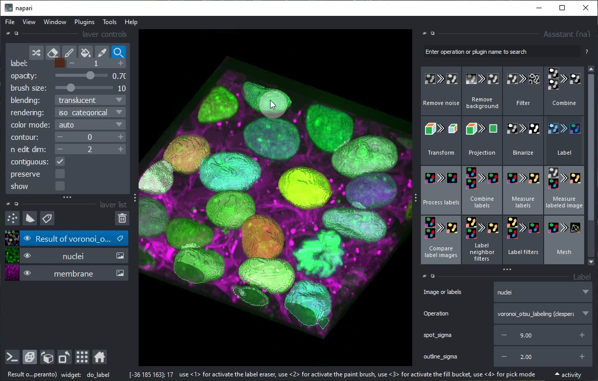


