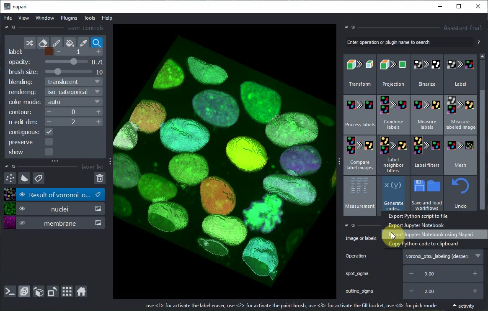
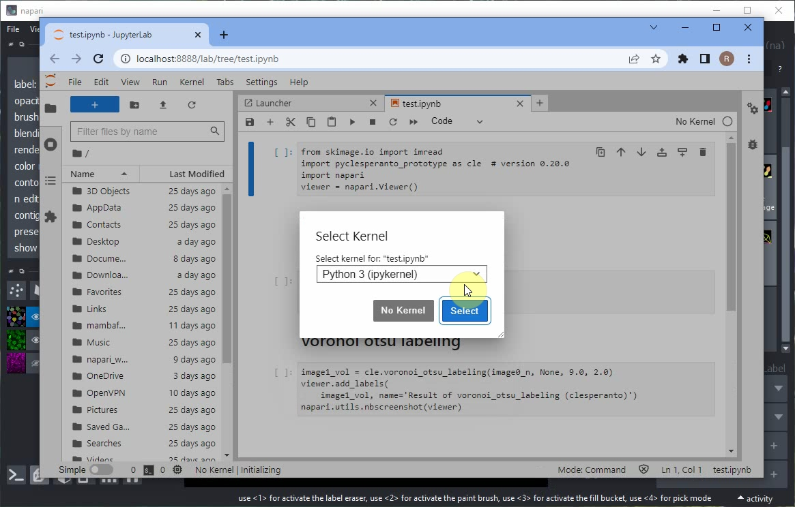
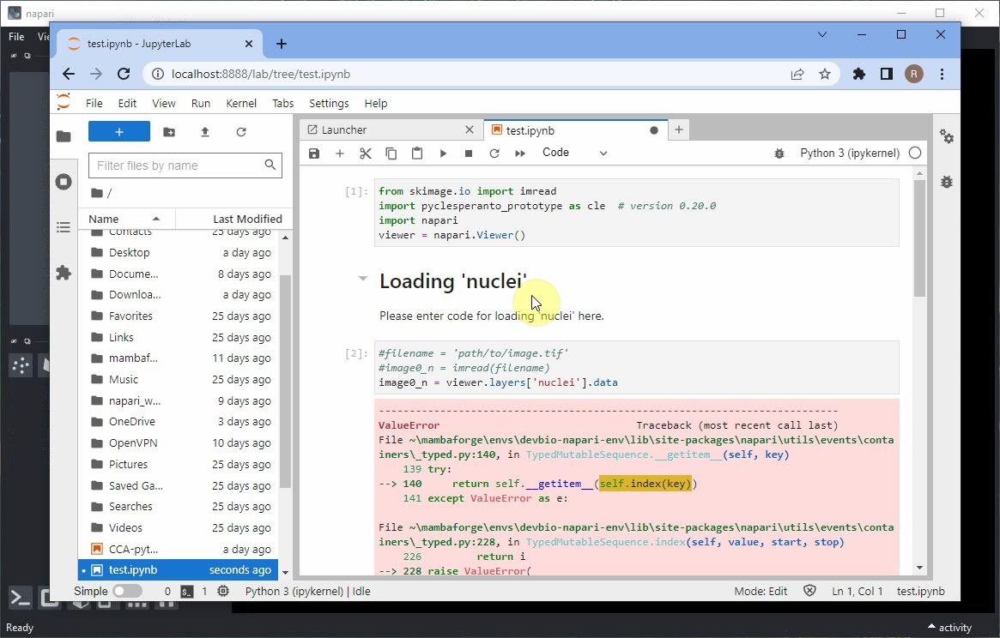
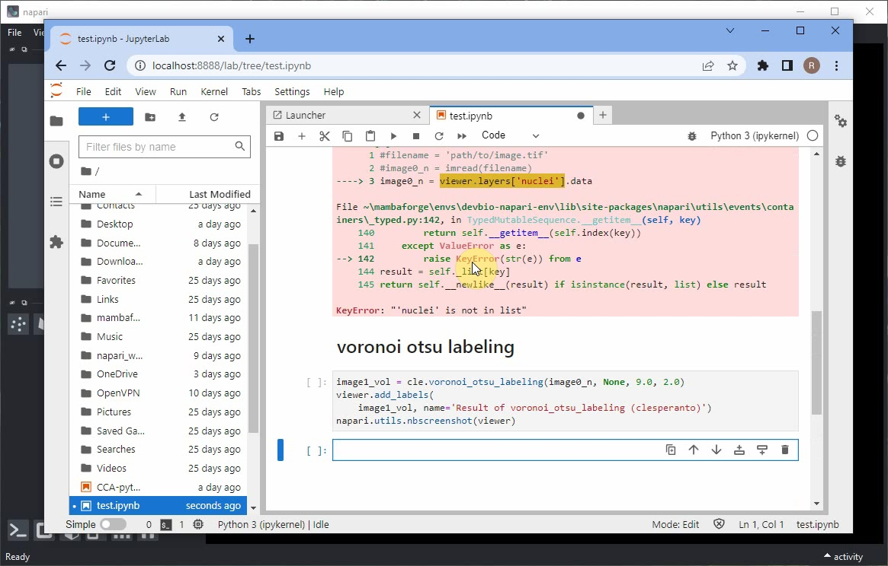
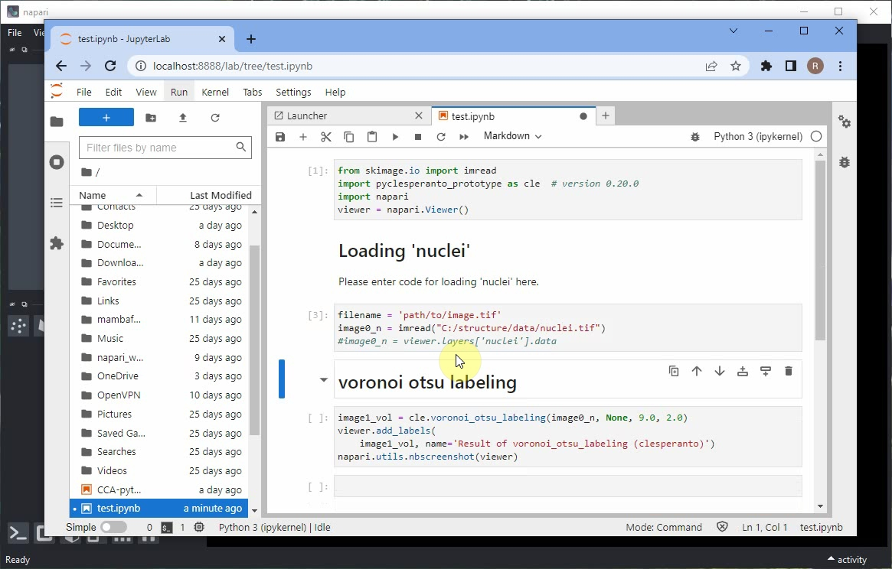
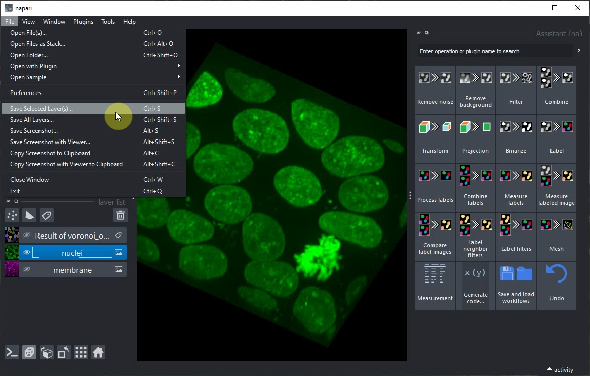
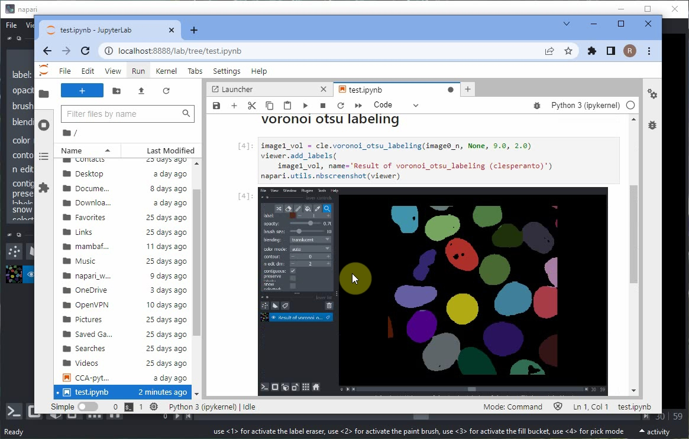
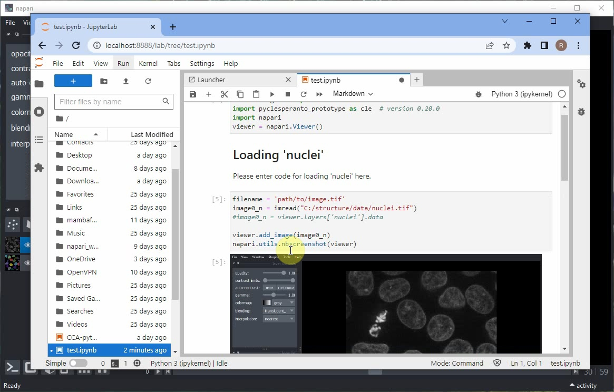
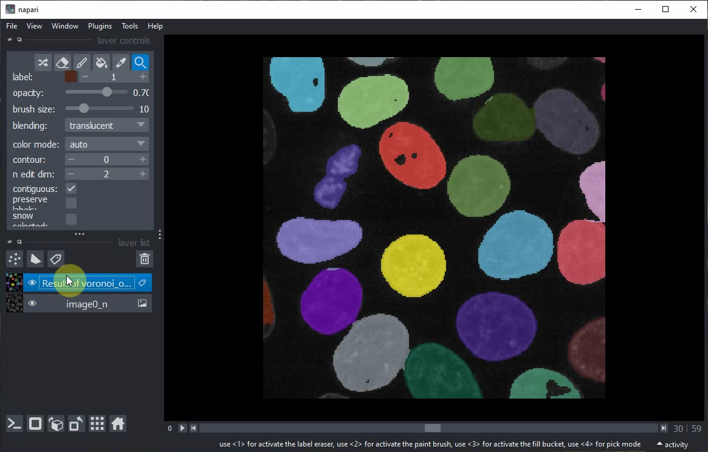

# Generating Jupyter Notebooks from the Napari Assistant

After setting  up a workflow using the Napari Assistant, we can export Python code, e.g. as Jupyter Notebook.

This tutorial is also available as video [export_notebooks.mp4](images/export_notebooks.mp4)

In the Assistant panel, click on the `Generate Code...` button and the `Export Jupyter Notebook using Napari` menu.



Jupyter lab will open and ask you to select a Kernel. Keep the default option and click on `Select`.



When executing the notebook, errors may appear, e.g. when loading the data. 



Scroll down to the end of the error message to read what didn't work.



Scoll up again to the notebook cell that didn't work and modify the code so that it uses the `imread` function to load the image from disc.



In case you don't have the `nuclei` image saved on disc already, use the menu `File > Save current Layer(s)` to save the `nuclei` layer as `.tif` file.



Afterwards, rerun the notebook and inspect the result. The Napari viewer that opened in the background will also be shown within the notebook.



If you also want to view the raw image data together with the segmentation result, add these lines to your code:

```python
viewer.add_image(image0_n)
napari.utils.nbscreenshot(viewer)
```



Rerun the notebook, or modify the order of layers manually in the Napari viewer. At the end it should look like this.



Voila! You have now generated a Jupyter Notebook from a Napari Assistant workflow. This notebook documents your work reproducibly and can be shared with others.
