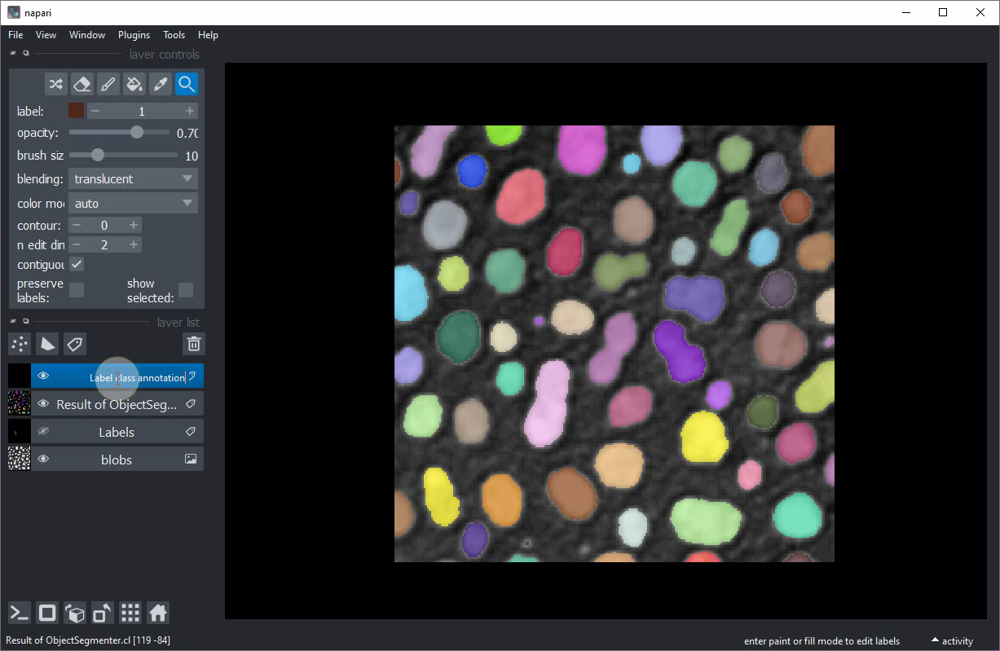
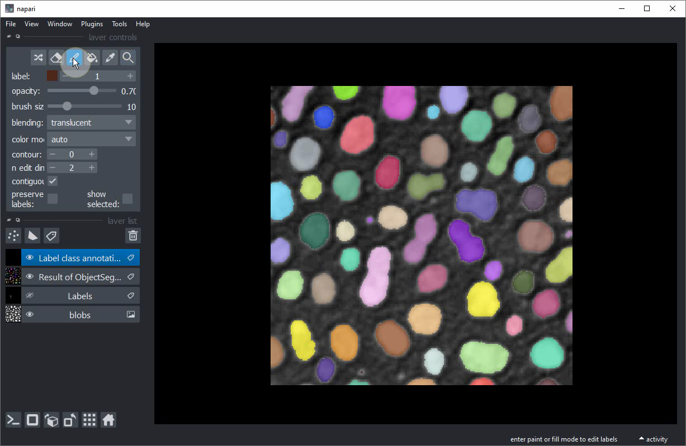
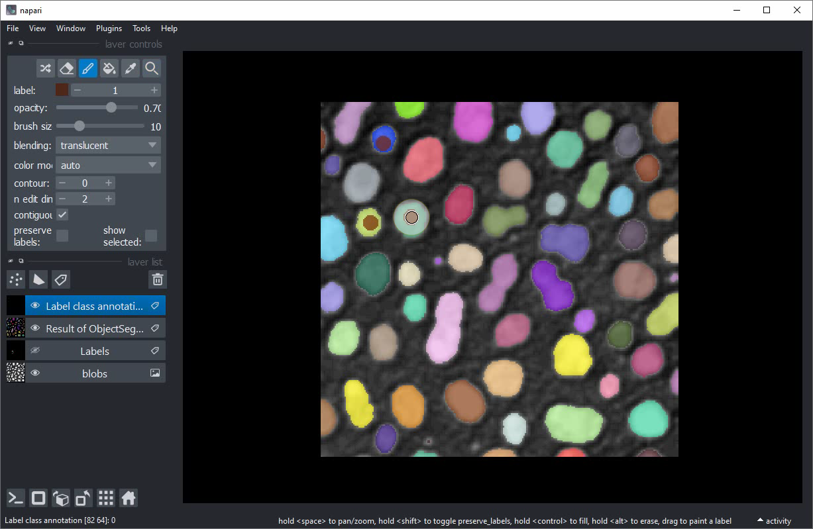
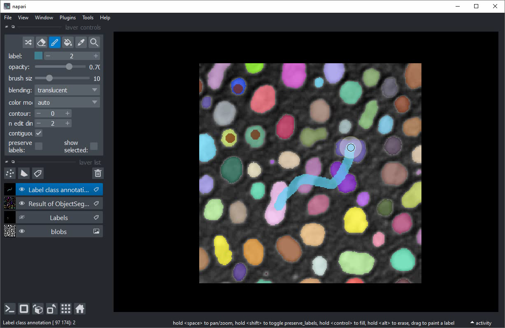
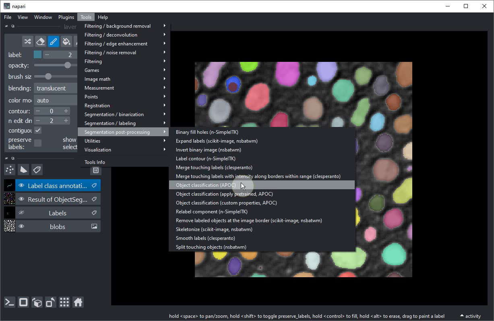
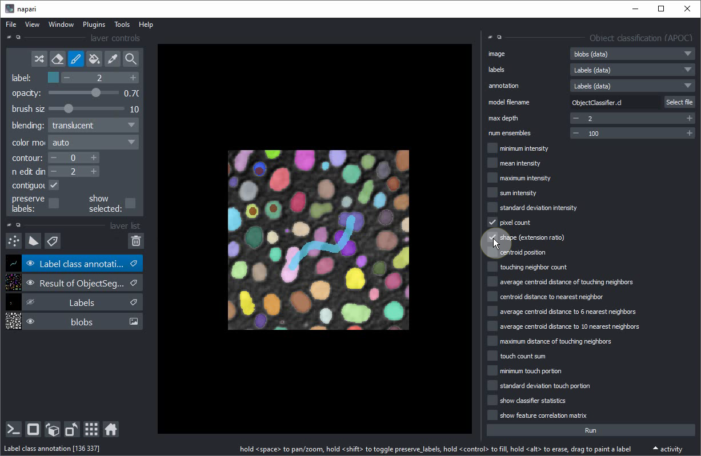
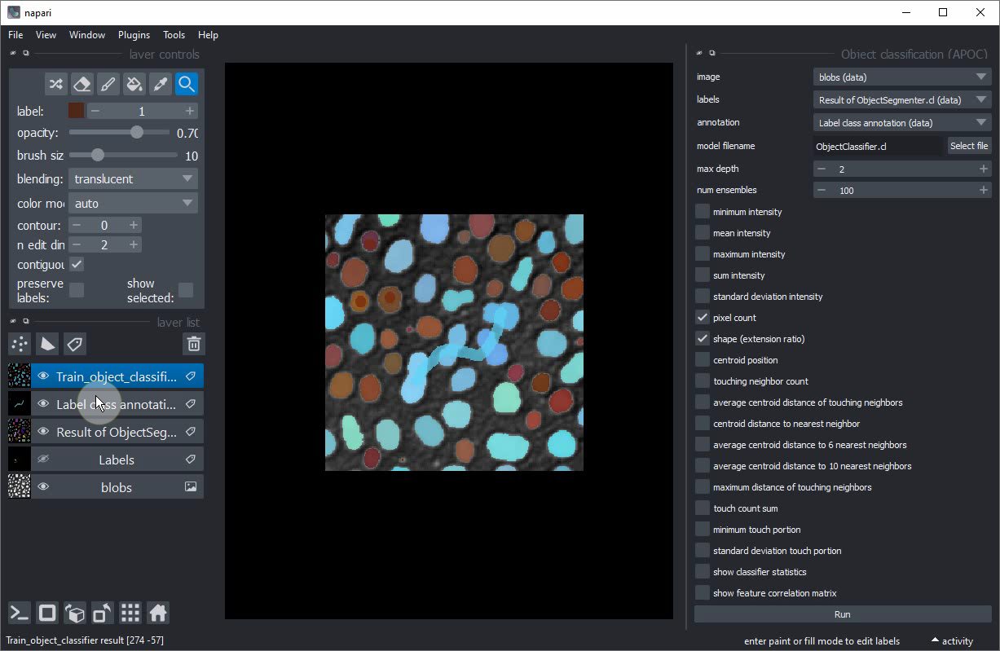
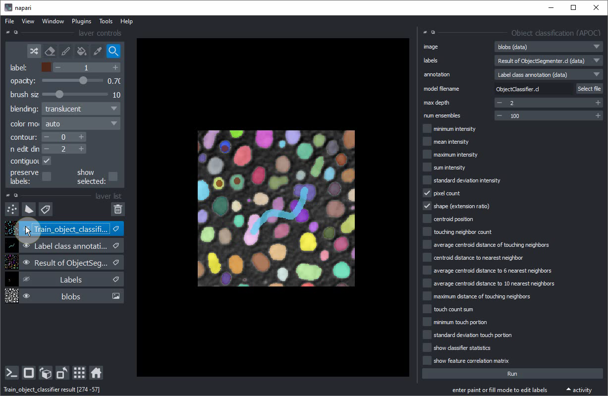
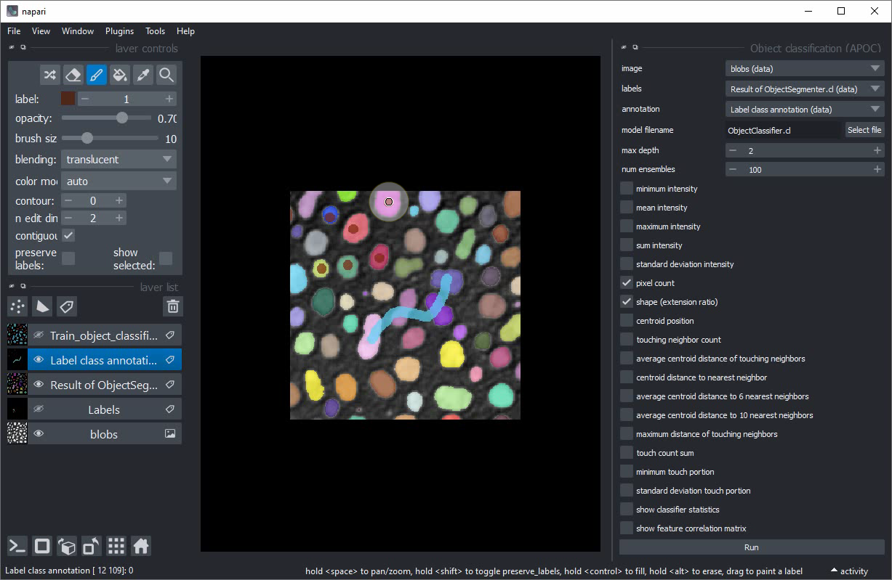
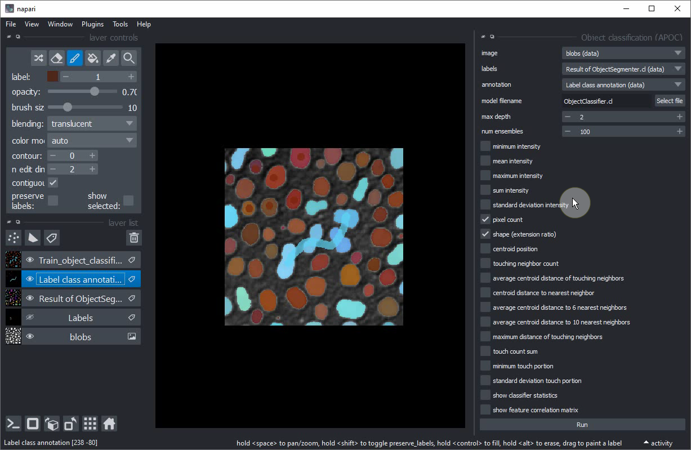

# Interactive object classification in Napari

In this exercise we will train a [Random Forest Classifiers](https://en.wikipedia.org/wiki/Random_forest) for classifying segmented objects. 
We will use the napari plugin [napari-accelerated-pixel-and-object-classification](https://www.napari-hub.org/plugins/napari-accelerated-pixel-and-object-classification).

## Getting started

Open a terminal window and activate your conda environment:

```
conda activate devbio-napari-env
```

Afterwards, start up Napari:

```
napari
```

Load the "Blobs" example dataset from the menu `File > Open Sample > clEsperanto > Blobs (from ImageJ)`

We furthermore need a label image. You can create it using the [pixel classifier trained earlier](machine_learning:pixel_classification) 
or using the menu `Tools > Segmentation / labeling > Gauss-Otsu Labeling (clesperanto)`.

## Object classification

Our starting point is a loaded image and a label image with segmented objects. The following procedure is also shown in [this video](apoc_object_classification.mp4).


Add another label image. Rename the label image e.g. to `Label class annotation` to not mix it up with the other.


Activate the `Brush tool`.


Put small dots with label `1` into small roundish objects (for training purposes: really just the smaller ones).


Increase the `label` to `2`.


Draw a line throught the larger elongated objects in the center of the image.


Start the object classification tool from the menu `Tools > Segmentation post-processing > Object classification (APOC)`


In this user-interface, activate the `shape` checkbox.


Select `image`, `labels` and `annotation` like this:


Click on `Run`. After a second a new labels layer with brown / blue annotated objects should appear. Some larger round objects will be blue unintentionally.


Hide the newly created classification layer.


Select your annotation layer.


Annotate some more roundish objects, this time the larger ones.


Train the classifier again.


If you are happy with the trained classifier, copy the file to a safe place. When training the next classifier this one might be overwritten.

## Extra exercise
Retrain the classifier so that it can differentiate three different classes:
* Small round objects
* Large round objects
* Large elongated objects
