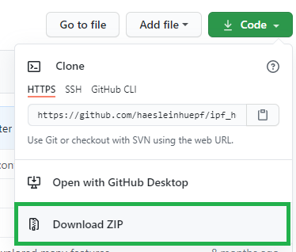

[![CC BY 4.0][cc-by-shield]][cc-by]

This work is licensed by Anna Poetsch, [Biotec Dresden](https://tu-dresden.de/cmcb/biotec/forschungsgruppen/poetsch) and Robert Haase, [PoL Dresden](http://physics-of-life.tu-dresden.de/bia) under a
[Creative Commons Attribution 4.0 International License][cc-by].

[cc-by]: http://creativecommons.org/licenses/by/4.0/
[cc-by-image]: https://i.creativecommons.org/l/by/4.0/88x31.png
[cc-by-shield]: https://img.shields.io/badge/License-CC%20BY%204.0-lightgrey.svg

# Bio-image analysis, biostatistics, programming and machine learning for computational biology
This repository contains training resources for Python beginners who want to dive into image processing with Python. 
It specifically aims for students and scientists working with microscopy images in the life sciences.
We start with python basics, dive into descriptive statistics for working with measurements and [matplotlib](https://matplotlib.org/) for plotting results.
Furthermore, we will process images with [numpy](https://numpy.org), [scipy](https://www.scipy.org/), [scikit-image](https://scikit-image.org/) and [clEsperanto](https://github.com/clEsperanto/pyclesperanto_prototype).
We will explore [napari](https://napari.org) and [Fiji](https://fiji.sc) for interactive image data analysis. 
Finally, we will use [scikit-learn](https://scikit-learn.org/stable/), [CellPose](https://github.com/MouseLand/cellpose) and [StarDist](https://github.com/stardist/stardist) to process images using machine learning techniques.

The material will develop between April and July 2022. The materials from former years are linked below.

## How to use this material
You can browse the material online for taking a quick look.
If you want to do the exercises, it is recommended to download the whole repository, e.g. by hitting the `code` button in the top right corner and clicking on download.
Unzip the downloaded zip-file and navigate inside the sub folders, e.g. using the command prompt. 
In order to execute code and do the exercises, you need to install conda, which will be explained in the first lesson.

This course explains everything in very detail. 
Every lesson ends with an exercise and it is recommended to do it before moving on to the next lesson. 
If you have python basics knowledge already, test yourself by doing these exercises before starting with an advanced lesson.

## Feedback and support

If you have any questions, please use the anonymous etherpad (see email) or open a thread on [image.sc](https://image.sc), put a link to the lesson or exercise you want to ask a question about and tag @haesleinhuepf.

## Contents

* Introduction (2022-Apr-05)
  * [Introduction to bio-image analysis, programming, bio-statistics and machine learning (slides)](01_python_basics/Introduction_QBIA.pdf)
  * [Trailer](01_python_basics/00_trailer.ipynb)
  * [Setting up your computer with conda](https://biapol.github.io/blog/johannes_mueller/anaconda_getting_started/)
  * [Our first jupyter notebook](01_python_basics/01_our_first_juptyer_notebook.ipynb)
  * [Math in Python](01_python_basics/02_Math_in_python.ipynb)
  * [Basic types in Python](01_python_basics/03_Basic_types.ipynb)
  
* Python data structures (2022-Apr-12)
  * [Python data structures (slides)](02_python_data_structures/Python_data_structures.pdf)
  * [Don't try this at home](02_python_data_structures/04_Dont_try_this_at_home.ipynb)
  * [Lists and tuples](02_python_data_structures/05_lists_tuples.ipynb)
  * [Cropping lists](02_python_data_structures/05a_cropping_lists.ipynb)
  * [Sorting lists](02_python_data_structures/05b_sorting_lists.ipynb)
  * [Dictionaries and tables](02_python_data_structures/06_Dictionaries_and_tables.ipynb)
  * [Masking](02_python_data_structures/08_masking.ipynb)
  * [Loading and visualizing images](02_python_data_structures/09_Working_with_images.ipynb)
  * [Cropping images](02_python_data_structures/10_Cropping_images.ipynb)

* Python algorithms (2022-Apr-19)
  * [Python algorithms (slides)](03_python_algorithms/Python_algorithms.pdf)
  * [Conditions](03_python_algorithms/07_Conditions.ipynb)
  * [Loops](03_python_algorithms/08_loops.ipynb)
  * [Custom functions](03_python_algorithms/09_custom_functions.ipynb)
  * [Custom libraries](03_python_algorithms/10_custom_libraries.ipynb)
  
* Introduction to image visualization, processing and filtering (2022-Apr-26)
  * [Image Processing and Filtering (slides)](04_image_processing_and_filters/Image_Processing_and_Filtering.pdf)
  * [Napari Introduction](04_image_processing_and_filters/1_Napari_introduction.ipynb)
  * [Histogram](04_image_processing_and_filters/2_Histogram.ipynb)
  * [Brightness and Contrast](04_image_processing_and_filters/3_Brightness_and_Contrast.ipynb)
  * [Binarization](04_image_processing_and_filters/4_Binarization.ipynb)
  * [Image Filters](04_image_processing_and_filters/5_Image_Filters.ipynb)
  * [Morphological Operations](04_image_processing_and_filters/6_Morphological_operations.ipynb)

* Quantitative image analysis (2022-May-03)
* Machine learning for bio-image analysis (2022-May-10)
* Introduction to Biostatistics (2022-May-17)
* Descriptive statistics (2022-May-24)
* Method Comparison - Bland-Altman analysis (2022-May-31)
* break
* Hypothesis testing (2022-Jun-14)
* Multiple comparisons and correlations (2022-Jun-21)
* Big data, clustering, dimensionality reduction (2022-Jun-28)
* Deep learning (2022-Jul-5)
* Summary / exam preparation (2022-Jul-12)

## See also

### Former & future lecture materials
* [Bio-image Analysis, programming, bio-statistics and machine learning 2021](https://github.com/BiAPoL/Bio-image_Analysis_with_Python/tree/a62070dee408814cee4258758f5187f135774519)
* [Bio-image Analysis, programming, bio-statistics and machine learning 2020](https://git.mpi-cbg.de/rhaase/lecture_applied_bioimage_analysis_2020)
* [Bio-image Analysis, ImageJ Macro programming 2019](https://git.mpi-cbg.de/rhaase/lecture_applied_bioimage_analysis)
* [Bio-image Analysis Notebooks](https://haesleinhuepf.github.io/BioImageAnalysisNotebooks/)

### Image Analysis
* [Analyzing fluorescence microscopy images with ImageJ by Pete Bankhead](https://petebankhead.gitbooks.io/imagej-intro/content/)
* [Basics of Image Processing and Analysis by Kota Miura](https://github.com/miura/ij_textbook1/raw/76b51338e1f006c580b6f0f5cfc48fe02fba38d7/CMCIBasicCourse201102Bib.pdf)
* [Classic ImageJ training resources](https://imagej.nih.gov/ij/docs/examples/index.html)
* [Bioimage Data Analysis Workflows edited by Kota Miura and Nataša Sladoje](https://link.springer.com/book/10.1007%2F978-3-030-22386-1)

### Python
* [Python cheat sheet](https://github.com/gto76/python-cheatsheet)
* [Python/Conda environments](https://mpicbg-scicomp.github.io/ipf_howtoguides/guides/Python_Conda_Environments)
* [Scientific data analyis in Python, Biotec lecture](https://youtu.be/MOEPe9TGBK0)
* [Python for Microscopists, video series by Sreeni](https://www.youtube.com/channel/UC34rW-HtPJulxr5wp2Xa04w)
* [Managing Conda environments, online documentation](https://docs.conda.io/projects/conda/en/latest/user-guide/tasks/manage-environments.html)
* [Bio-image Analysis using Scikit-Image in Python, Biotec lecture](https://youtu.be/FnvgepHDqRA)
* [Python for Bio-image Analysis by the Image Analysis Focused Interest Group of the Royal Microscopical Society](https://github.com/IAFIG-RMS/Python-for-Bioimage-Analysis)
* [Interactive Bioimage Analysis with Python and Jupyter, NEUBIAS academy webinar](https://youtu.be/2KF8vBrp3Zw), [Part 2](https://youtu.be/Y3pB3wnOivE)
* [Multi-dimensional image visualization in Python using napari, NEUBIAS Academy webinar](https://youtu.be/VgvDSq5aCDQ)

## Contributing
Contributions to this repository are welcome! If you see typos, bugs or have general feedback, please create a [github issue](https://github.com/BiA-PoL/Bio-image_Analysis_with_Python_course/issues) to let us know. 
If you would like to add additional lessons or want to suggest improvements to existing ones, [pull-requests](https://github.com/BiA-PoL/Bio-image_Analysis_with_Python_course/pulls) are very welcome!

## Acknowledgements
[Robert Haase](https://twitter.com/haesleinhuepf/) was supported by the Deutsche Forschungsgemeinschaft (DFG, German Research Foundation) under Germany’s Excellence Strategy – EXC2068 - Cluster of Excellence Physics of Life of TU Dresden.

[Imprint](https://tu-dresden.de/impressum)
