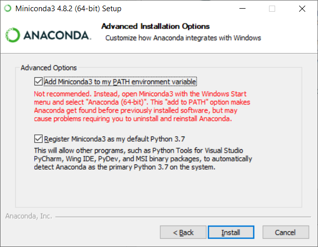
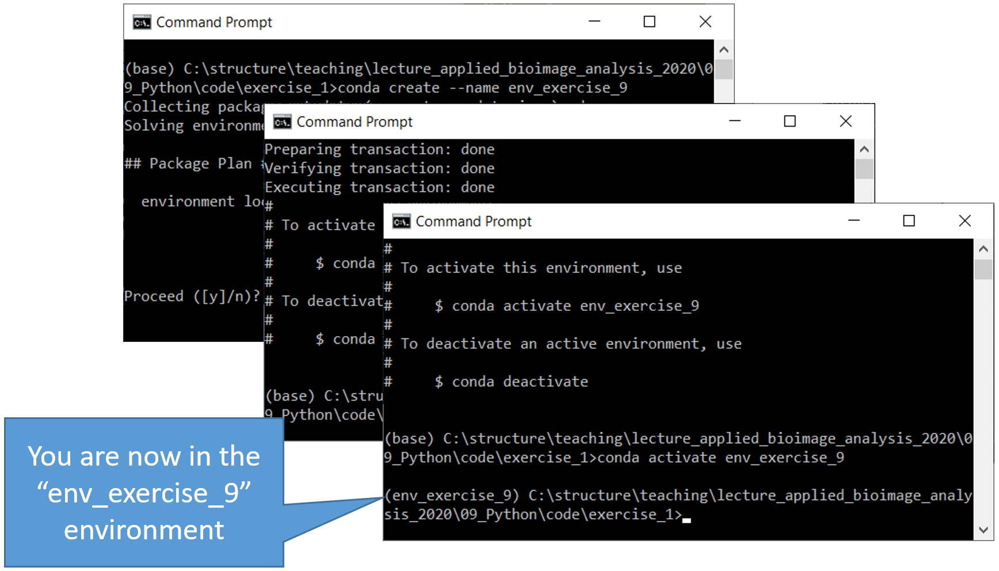
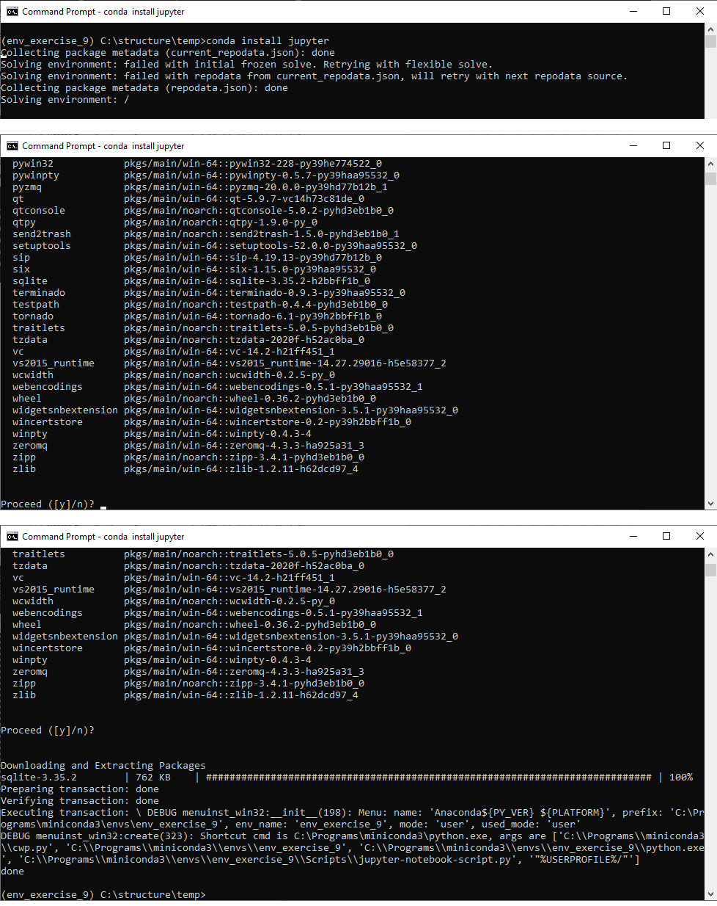
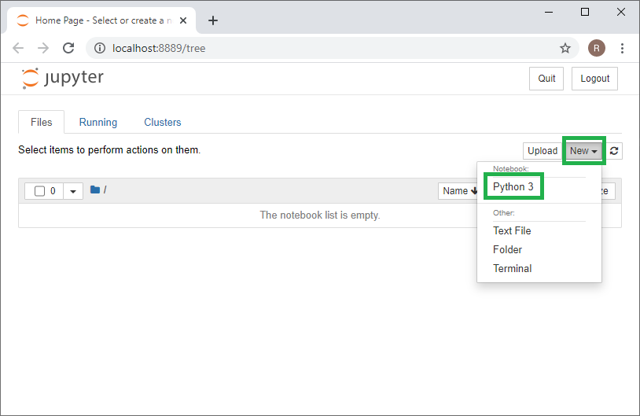
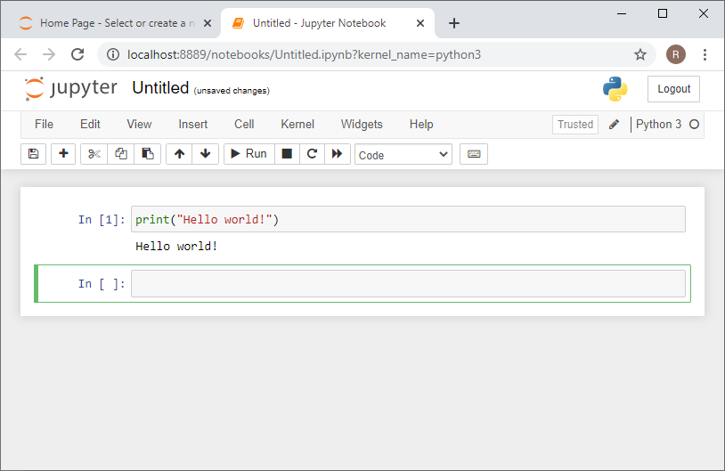

# Setting up Python / Conda environments
When working with Python, we will make use of many plugins and software libraries which need to be organized.
One way of doing this, is by managing so called "Conda" environments.
A conda environment can be seen as a virtual desktop, or virtual computer, accessible via the command line. 
If you install some software into one conda environment, it may not be accessible from another environment.

See also 
* [Python/Conda environments](https://mpicbg-scicomp.github.io/ipf_howtoguides/guides/Python_Conda_Environments)
* [Scientific Data Analysis with Python](https://youtu.be/MOEPe9TGBK0).

## Step 1: Install Conda
Download and install conda, for example mini-conda 
[for Windows](https://docs.conda.io/en/latest/miniconda.html#windows-installers), 
[for Linux](https://docs.conda.io/en/latest/miniconda.html#linux-installers) or
[for MacOS](https://docs.conda.io/en/latest/miniconda.html#macosx-installers).

For ease-of-use, it is recommended to add conda to the PATH variable during installtion, e.g. by checking this checkbox:



### Step 1: Starting conda

After installation, you can start conda from the terminal or command line like this:

```
conda activate
```

You will then see the term `(base)` at the beginning of each line:


## Step 2: Creating a conda environment
You can create a conda environment with this command:
```
conda create ––name env_exercise_9
```

In some projects, you may want to start using python right away. Thus, you can specify to install python in a given version to your new conda environment from the start:
```
conda create -n env_exercise_9 python=3.8
```

And afterwards you can enter the environment to work within it. 
Whenever you want to work on the same project again, you should start a command line and enter this:
```
conda activate env_exercise_9
```

**Tip**: It is recommended to create one environment for every project you are executing. 
In that way installed software libraries and tools cannot harm each other.



## Step 3: Installing software tools and libraries
We will use python mostly from [jupyter notebooks](https://www.jupyter.org). 
Before we can do so, we need to install it. 
We can do that using the `conda install` command:

```
conda install jupyter
```

As you can see, jupyter comes with many other libraries and tools it needs to execute.
Check that you entered the right tool to install. E.g. take care that `jupyter` contains a `y` and no `i`.
Enter `y` and hit ENTER to start the installation process. 
As the `y` is pre-selected, as shown with the square brakets `[y]`, you can also just hit ENTER.



## Step 3: Testing the installation
To get started with Jupyter notebooks, start them from the command line in your activated environment using:

```
jupyter notebook
```

A browser will open and show you the following web page. Click on "New" in the top right corner and select "Python 3":


In the new tab, click in the first code cell, enter `print("Hello world")` and hit SHIFT+ENTER on your keyboard. 
If everything is installed properly, it should look like this:


E.g. if python is not installed yet, you need to install it using this command:
```
conda install python
```

**Tip**: You will later need to install more packages and software. 
However, while you are running jupyter notebooks, you cannot enter new commands in the command line.
Thus, it is recommended to open two command line windows and activate the same conda environment at the same time. 
In one windows, you run `jupyter notebook` and in the other `conda install name_of_the_software_that_isnt_installed_yet`.
